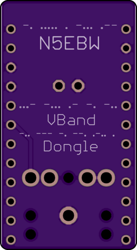
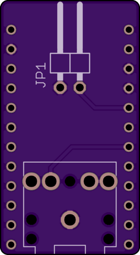
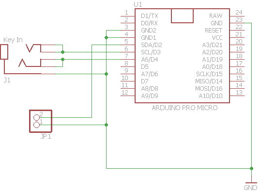

# Ham Radio Solutions - VBand Dongle Clone

I created this just for fun, as a tinkerer I took a look at the most prevalent
DIY solution for this that uses an Arduino Pro Micro.  I highly recommend the
actual solution on the Ham Radio Solutions - https://hamradio.solutions/vband/

Unless you're just itching to tinker or looking to do a ham club project, that
design is only 25 bucks and VERY reasonably priced, you probably can't build
this for that much in small quantities.  Go support those guys,
they're amazing and notable supporters of the DIY community in kind.

Now, if I haven't dissuaded you from rolling your own, a few things:

## The Hardware
This project includes a BOM, which is really just a specific TRS jack other
than the board, Arduino Pro Micro, a 90 degree 2 pin header (which really is
largely unnecessary), and that's about it.

Also included are gerber files that you can use to submit to any board house of
your choice, and pictures for reference.  I use OSHPark for my prototyping and
you can find the shared project for sale here if you just want to order.  I get
NOTHING from those sales, and I'm totally fine with that!
https://oshpark.com/shared_projects/HH9dUUS9

## The Schematic
Nothing special.  Follow the goes-into's and goes-outta's and you'll be fine.

## The Software
Adapted without shame from a design by OZ1JHM found here -
http://oz1jhm.dk/content/hamradio-solutions-vband-interface

I had a few problems with their implementation, albeit a good start.  After
looking at the code, I noticed that every loop was causing the keyboard to send
a releaseAll(), which was happening about every 5ms according to the delay
timer.  This, even though a working design, caused the TX light on the Pro Micro
to shine constantly, and I may still have a spot in my vision from the bright
light it generated.  It also caused some issues with attempting to place new
code onto the Arduino.  I had to force it to bootstrap mode because it tied up
the USB interface so much that I could not place code onto the chip.

The resulting design I came up with uses a global state approach, only sending
keyboard traffic when one of the states of the inputs change, and evaluating the
logic accordingly based on those states.  This is a MUCH "quieter" loop, and the
TX LED only comes on when a control key is either pressed or released.  As I
stated earlier, the header pin is largely deprecated in this design I believe.
You can set VBand to either it's keyer function, or a straight key, which would
in turn allow you to use either an external keyer or a straight key without
modification.  It may eventually be eliminated from subsequent designs but it's
not hurting anything.  Feel free to omit if you want to save 3 cents.

It's all in one file: [a relative link](src/hrs_vband_interface/hrs_vband_interface.ino)

If you modify this firmware, I'd love it if you would create a fork, and send me
a pull request.  I'll track it on a separate branch and, who knows, if it's
super useful I'll pull it into main.
